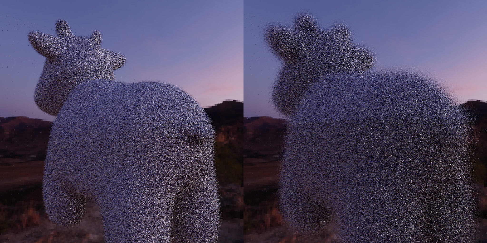

# mupsi — GPIS Soft Renderer

**μ + ψ = f** — A CPU-based Monte Carlo path tracer for Gaussian Process Implicit Surfaces.


<p align="center"></p>

mupsi models surfaces as the zero level-set of a **random implicit function** `f(p)=μ(p)+ψ(p)`, where `μ` is a deterministic SDF and `ψ` is a zero-mean Gaussian Process encoding microscopic roughness. Using sparse convolution noise, it achieves `O(1)` per-query GP evaluation and supports **pathwise conditioning** (Renewal+) for geometrically consistent rough surfaces across all ray bounces — spanning a unified continuum from smooth surfaces to volumetric media.

## Key Features

- **Sparse Convolution GPIS** — `O(1)` evaluation via hash-based noise impulses + SE kernel convolution (Xu et al. 2025)
- **Renewal+ Pathwise Conditioning** — surface pinning `f(C)=0` and normal matching `∇f(C)=n` at every hit point
- **Full Path Tracer** — NEE, Russian roulette, OpenMP parallelism
- **Sphere & Mesh Mean Functions** — SDF primitives with OBJ loader + custom BVH
- **Interactive Editor** — ImGui + GLFW live parameter tuning
- **HDR Skydrome** — environment map lighting

## Math Overview

```
GPIS:           f(p) = μ(p) + ψ(p),    ψ ~ GP(0, κ)
Sparse Conv:    ψ(p) ≈ Σᵢ wᵢ·h(sᵢ,p),  h(s,p) = exp(-‖p-s‖²/L²)    [O(1)]
Conditioning:   ψ_cond(p) = ψ(p) + ũ·h(C,p) + g̃·∇h(C,p)
```

## Build

Requirements: **CMake ≥ 3.16**, **C++20** compiler, **Eigen3**, **OpenCV**, **OpenMP**, **nlohmann_json**.

```bash
mkdir build && cd build
cmake .. -DCMAKE_BUILD_TYPE=Release
make -j$(nproc)
```

Optional editor (needs **GLFW** + **OpenGL**):

```bash
# auto-detected; rebuild if deps found
make -j$(nproc) mupsi-editor
```

Nix users:

```bash
nix develop   # direnv: just cd in
```

## Usage

```bash
# Headless render (reads scene.json by default)
./build/mupsi

# Interactive editor
./build/mupsi-editor
```

### Config Schema (`scene.json`)

```jsonc
{
  "width": 256, "height": 256,           // image resolution
  "spp": 20,                              // samples per pixel
  "max_bounce": 10, "max_medium_bounce": 10,
  "gp_mode": "renewal_plus",             // or "single_realization"

  "camera": { "pos": [0,0,0], "dir": [0,0,-1], "up": [0,1,0], "fov": 45 },

  "kernel": {
    "sigma": 1.0, "length_scale": 1.0,   // SE kernel params
    "aniso": [1,1,1],                     // anisotropic scaling
    "points_per_cell": 3                   // sparse grid density
  },

  "gp_medium": {
    "mean_type": "sphere",               // or "mesh"
    "mean_center": [0,0,-500],            // for sphere mean
    "mean_radius": 70
    // "file": "model.obj",              // for mesh mean
    // "transform": { "scale": 1.0, "translate": [0,0,0] }
  },

  "skydrome": "/path/to/envmap.hdr",

  "primitives": [
    {
      "type": "sphere",
      "center": [0,0,-500], "radius": 130,
      "bsdf": "null",                    // or "lambertian", "specular"
      "int_medium": true                  // contains the GP medium
    },
    {
      "type": "mesh",
      "file": "bunny.obj",
      "bsdf": "lambertian",
      "emission": [0,0,0],
      "transform": { "scale": 2.0, "translate": [0,0,-5] }
    }
  ]
}
```

### GP Modes

| Mode | Behavior |
|------|----------|
| `single_realization` | Each pixel independently samples ψ — noisy surfaces |
| `renewal_plus` | Pathwise conditioning at every hit — consistent surface |

## Architecture

```
src/
├── gp/            GP core (kernel, noise generator, mean functions)
├── medium/        Ray-marching GP/SDF media, pathwise conditioning
├── rendering/     Path tracer, camera, framebuffer, trace loop
├── geometry/      Scene, mesh (OBJ + BVH), ray, intersection
├── primitives/    Sphere, skydrome, BSDF (Lambertian/Null/Specular)
├── bvh/           Bounding volume hierarchy with Möller–Trumbore
├── controller/    JSON config parser, render thread management
├── editor/        ImGui + GLFW interactive editor
└── io/            PNG output, config serialization
```

## References

- Xu et al. (SIGGRAPH Asia 2025): *Practical Gaussian Process Implicit Surfaces with Sparse Convolutions*
- Seyb & Jarosz (2024): *From Microfacets to Participating Media: A Unified Theory of Light Transport with Stochastic Geometry*

## License

MIT
